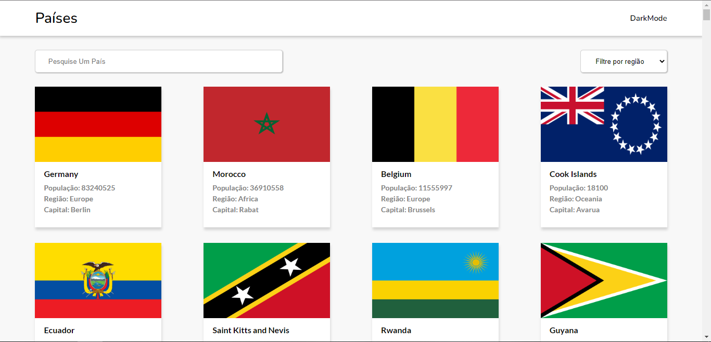

<h1 align="center">
   Países
</h1>

  <a href="https://willianstephano.github.io/Paises/">
    <b>🚀Acesse o projeto 🚀</b>
  </a>
  
 <h5 align="center">
  Projeto em construção
</h5>

<h4 align="center">
  Projeto criado com o intuito de aprimorar meus conhecimentos nas tecnologias HTML, CSS, Js e consumo de API.
</h4>

<h6 align="center">
  O projeto consome a API RestCountries para consulta de dados dos paises.
</h6>

## 📚 Seções
O projeto é composto por uma pagina que contem 3 seções principais:

- **Pesquisa e filtro:** Barra de pesquisa que busca o nome do pais que funciona no idioma pt-br e um filtro por regiao dos paises;
- **Seção Países:** Contem informações de população, nome da capital e região de todos os paises disponiveis na API assim como imagem de suas respectivas bandeiras em um card;
- **Modal detalhes:** Ao clicar em um card abre um modal gerado dinamicamente contendo informações detalhadas acerca do pais selecionado;

---

## 💼 Tecnologias utilizadas
Para o desenvolvimento deste projeto utilizei as seguintes tecnologias:

- HTML;
- CSS;
- JavaScript;
- API utilizada: https://restcountries.com/

---

#### Autor
Willian Stephano
